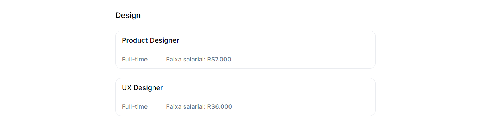
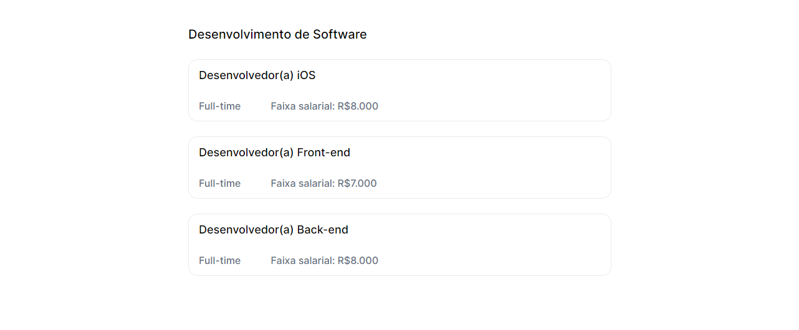
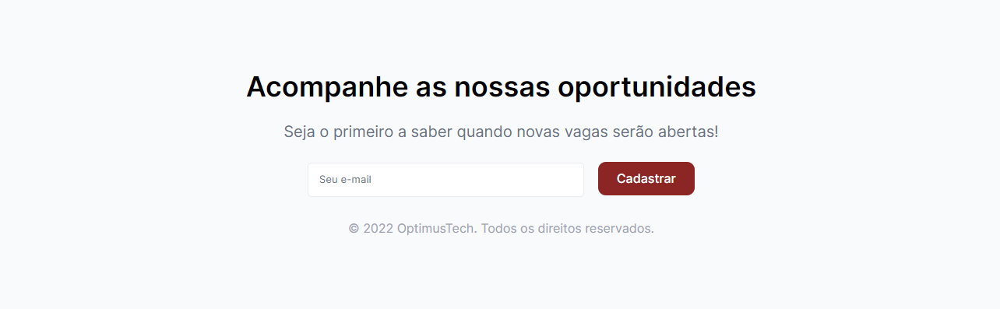

# OptimusTech
Participei do desafio 7DaysOfCode de prática de HTML e CSS, da Giovanna Moeller, professora da escola Alura, para criar uma landing page.

## Navegador

## Cabeçalho

## Seção de Métricas

## Seção de Depoimentos

## Seção de Vagas

## Rodapé

## Confere o site completo <a href="optimus-tech-tawny.vercel.app">aqui</a>: 
OBS: O site não é responsivo! Utilize no computador, para uma melhor experiência.